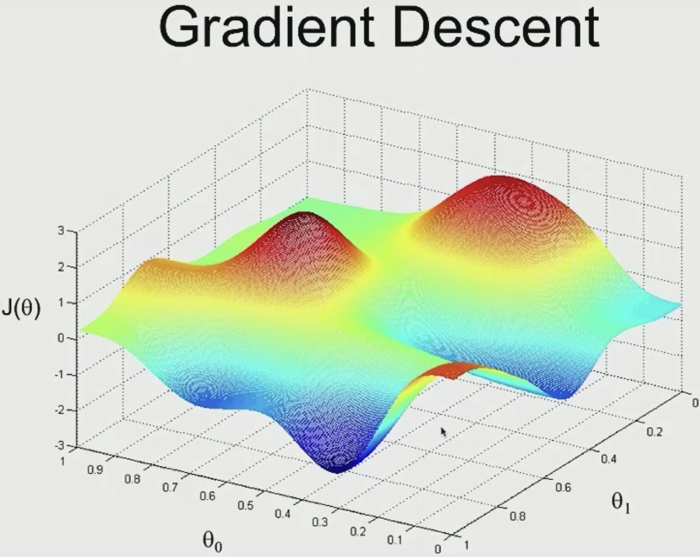

# Linear Regression and Gradient Descent

This document contains notes for lecture 2 on Machine Learning for CS229 at Stanford by Andrew Ng.

Topics discussed in lecture

- Linear Regression/Ordinary Least Squares
- Batch/Stochastic Gradient Descent
- Normal Equations

## Supervised  Learning

Inputs x mapped to output y = Regression problem because output y is continuous
Simplest possible supervised learning regression problem = linear regression

### General workflow of a Linear Regression Problem

We have a couple mappings for the problem in the form of a training set

We feed it to a learning algorithm

It outputs a function that makes predictions

Function is a hypothesis where => we can feed new inputs and it will output the estimated output

### Designing a Learning algorithm

Structuring and designing a machine learning algorithm is important
  
Key Decisions:

- What is the workflow?
- What is the dataset?
- What is the hypothesis?
- How is the hypothesis represented? - First thing you need to ask
  - $$h(x) = O_{0} + O_{1}x$$ technically an affine function; but in ML we call it linear

## Housing Market Prediction

For the housing market problem => we have 2 input features where $x_{1} = size$ and $x_{2} =$ number of bedrooms so 

$$h(x) = O_{0} + O_{1}x_(1) + O_{2}x_{2}$$

This can be written as 

$$h(x) = \Sigma^{n}_{j=0} O_{j}x_{j}$$ 

where $x_{0} = 1$
 
Here 
$$\theta = \begin{bmatrix} \theta_{0} \\ \theta_{1} \\ \theta{2} \end{bmatrix}$$ 
is a 3-dimensional parameter

The features become a 3-dimensional feature vector - 
$$x = \begin{bmatrix} x_{0} \\ x_{1} \\ x{2} \end{bmatrix}$$

Key Decisions involved in linear regression:

$\theta =$ parameters; 
$m =$ # of training examples (number of rows in table);
$x =$ "input"/features; 
$y =$ "output"/target variable; 
$(x, y) =$ "training example"; 
$(x^{i}, y^{i}) = i^{th}$ training example;
$n =$ number of features

The learning algorithm's first job is to choose the values for parameters $\theta$ so that it can output a hypothesis; can be written as: 

Choose $\theta$ so that such that $$h(x) \approxeq y$$ for the training examples

Since $h_{x}$ depends on parameters $\theta$ and on input features $x$ we use 
$$h_{\theta} x = h(x)$$

### What makes Linear Regression accurate = Minimizing $J(\theta)$

One goal within the linear regression algorithm is to minimize the square difference between what the hypothesis outputs (prediction) and the correct price.

Formally written - the goal is to minimize $\theta$ for $J(\theta)$ where - 
$$J(\theta) = \frac{1}{2} \Sigma^{m}_{i = 1} (h_{\theta} (x^{i} - y)^{2}$$

The $\frac{1}{2}$ constant is put by convention to make it simpler to take derivatives and minimize it later.

This goal is achieved using an algorithm called <b>Gradient Descent</b>

Why not absolute error? => linear regression belongs to the family of generalizable algorithms and using the Least Square Error (LSE) corresponds to Gaussian (Don't entirely understand this yet)

## Gradient Descent

We start with some value of $\theta$ where we can say $\theta = \vec 0$ as a reasonable default - where $\theta$ is a 3-D vector

We keep changing $\theta$ to reduce $J(\theta)$

3-D Gradient Descent for any hypothesis with 2 parameters$

 
    

Our goal is to find values for $\theta_{0}$ & $\theta_{1}$ that minimizes the height of the surface $J(\theta)$, ie. the bluest portion of the graph above.

We start by initializing the $\theta$'s either randomly or to the value of all zeroes.

Imagine standing at the top of the red hill on the graph and taking in a 360 degree view of whatever was around you and see if you were to take a baby step - which direction would you take to go down as fast as possible to go to the lowest possible elevation in $J(\theta)$ = Gradient Descent does this iteratively in small steps.

### Interesting property of Gradient Descent

Depending upon where the parameters are initialized - there can be different local minima

When you run a GD algorithm (GDA) on linear regression = there won't be a local optimum

Each step of Gradient Descent is as follows:

$$\theta_{J} := \theta{J} - \alpha \frac{\delta}{\delta\theta_{j}} J(\theta)$$

where $\alpha$ is the "learning Rate" 